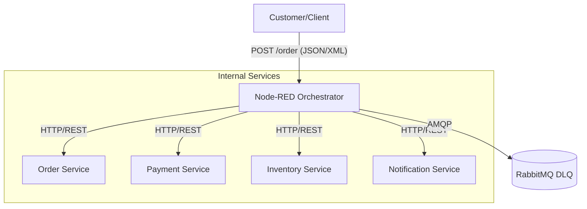
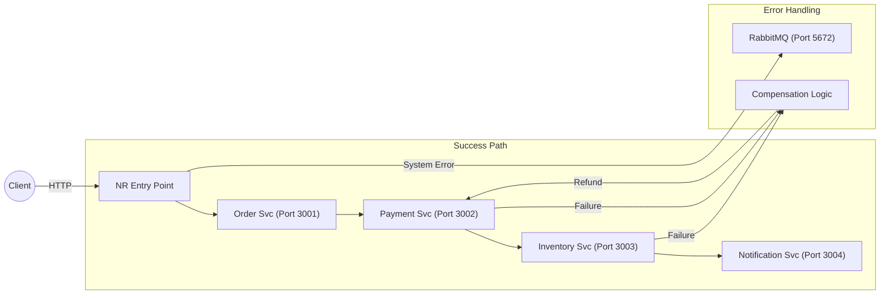
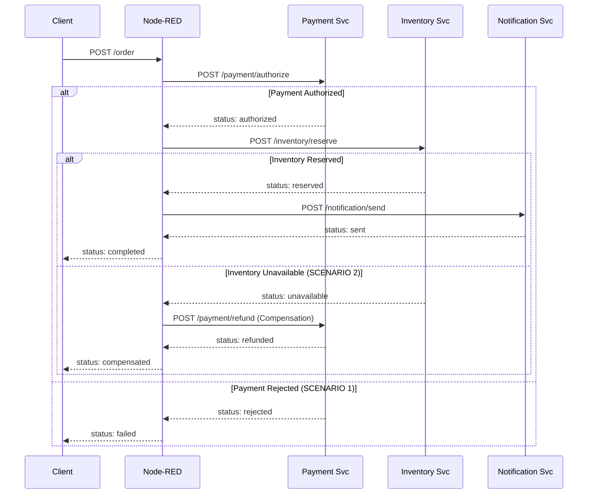

# Capstone: Orchestrated EAI System

## 1. Architecture Decision

**Chosen Approach: Option A (Node-RED as Entry Point)**
I chose this approach because it follows the **Pure Orchestrator** pattern. By making Node-RED the entry point, the business logic is completely decoupled from the individual microservices. This makes the system more flexible: we can change the order of steps or scale individual components without ever touching the code of the `Order Service`.

---

## 2. Architecture Diagrams

### 2.1 System Context Diagram

---

## 2.2 Integration Architecture Diagram

---

## 2.3 Orchestration Flow

---
## 3. Pattern Mapping Table

| Pattern | Category | Problem It Solves | Where Applied | Why Chosen |
| :--- | :--- | :--- | :--- | :--- |
| **Content-Based Router** | Routing & Flow | Handling different order formats (Standard vs Express). | Node-RED `switch` node at process start. | Allows the system to process multiple input types in one flow. |
| **Correlation Identifier** | Coordination | Tracking a single transaction across distributed services. | `msg.correlationId` passed in every request. | Essential for linking payments to refunds and log tracing. |
| **Message Translator** | Transformation | Incompatible API schemas between independent services. | Node-RED `change` nodes before HTTP calls. | Enables loose coupling so services stay independent. |
| **Saga (Orchestration)** | Coordination | Maintaining consistency without a shared Database. | Node-RED flow logic and compensation paths. | Ensures reliable rollbacks (Refunds) if a step fails. |

---

## 4. Failure Analysis

I successfully implemented and tested the two mandatory failure scenarios to ensure system reliability:

### Scenario 1: Payment Rejection
* **Setup**: `PAYMENT_FAIL_MODE` set to `always` in `docker-compose.yml`.
* **System Reaction**: The Payment Service returns a **402 Payment Required** status. Node-RED detects this via a `switch` node and immediately halts the orchestration.
* **Final State**: API returns `status: failed`. The Inventory service is **never called**.

### Scenario 2: Inventory Unavailable (Compensation)
* **Setup**: `PAYMENT_FAIL_MODE` set to `never`, `INVENTORY_FAIL_MODE` set to `always`.
* **System Reaction**: Payment succeeds, but Inventory returns **503 Service Unavailable**.
* **Compensation**: Node-RED catches the 503 error and triggers a **Compensating Transaction** (`POST /payment/refund`).
* **Final State**: API returns `status: compensated`.

---

## 5. AI Usage & Debugging Log

I used **Gemini AI** as an adaptive collaborator to design, debug, and refine this integration system. 

### Key Technical Challenges Solved:

1. **HTTP Status Code Logic**: 
   Refactored services to use explicit non-200 statuses (402/503) so Node-RED could trigger error paths.
2. **Strict Data Typing**: 
   Fixed a bug in the `switch` node by ensuring `msg.statusCode` is treated as a **Number (#)**, not a String.
3. **Persistent Trace State**: 
   Used **JSONata** `$append()` to maintain a full execution history, even during compensation steps.
