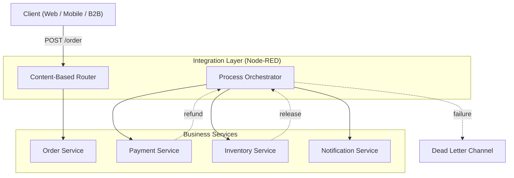
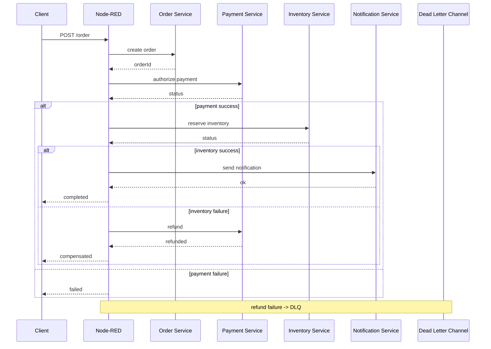
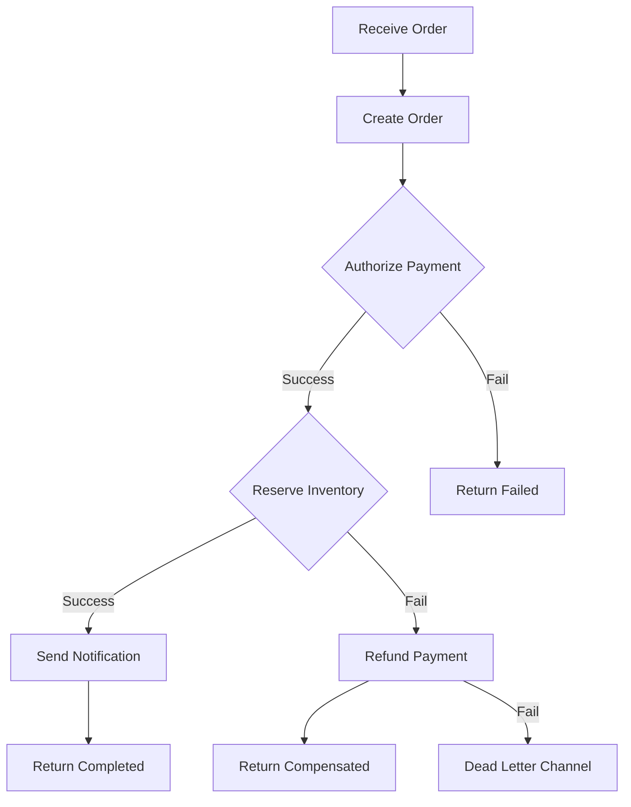

# Capstone: Orchestrated EAI System

## 1. Architecture Decision

**Chosen Approach: Option A (Node-RED as Entry Point)**
I chose this approach because it follows the **Pure Orchestrator** pattern. By making Node-RED the entry point, the business logic is completely decoupled from the individual microservices. This makes the system more flexible: we can change the order of steps or scale individual components without ever touching the code of the `Order Service`.

---

## 2. Architecture Diagrams

### 2.1 System Context Diagram


---

## 2.2 Integration Architecture Diagram
```markdown

---

## 2.3 Orchestration Flow
```markdown

---
